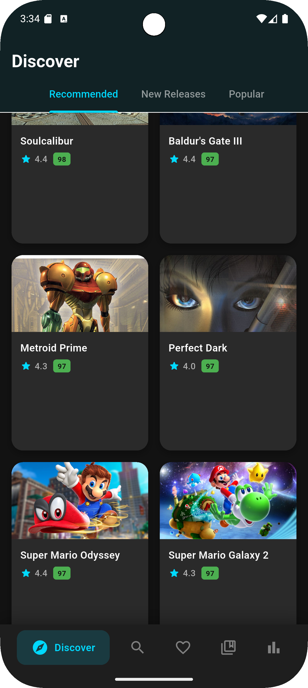
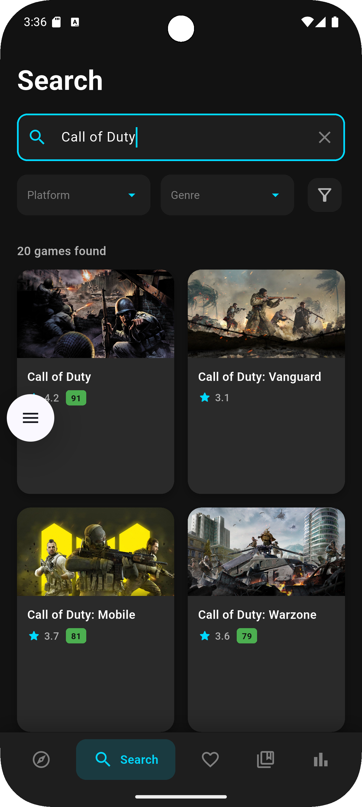
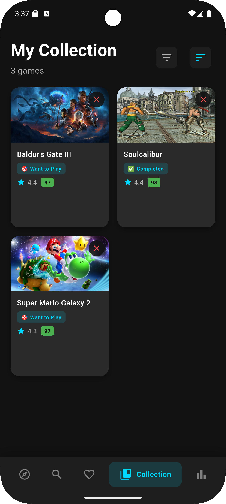
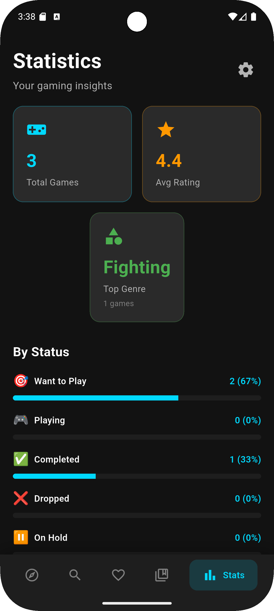
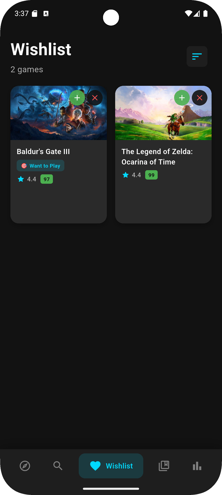
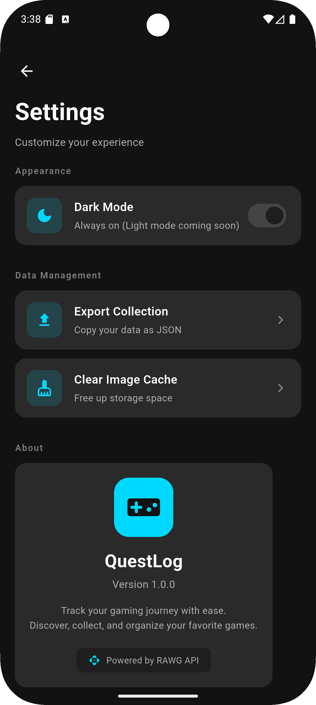

# 🎮 QuestLog

Hey there! I'm a fellow gamer who was tired of losing track of games I wanted to play. So I built **QuestLog** - a personal gaming companion that helps you discover new games, manage your collection, create wishlists, and actually understand your gaming habits.

As someone who constantly adds games to my mental "to-play list" only to forget them, I wanted something that felt like a natural extension of my gaming experience. This app started as a personal project and evolved into something I'm really proud of.

Built with **Flutter** and powered by the **RAWG Video Games Database API**.

---

## 🌟 Why I Built This

Let's be real - as gamers, we've all been there:
- 🤔 "What was that game I saw last week?"
- 📝 Writing game names on random notes
- 🔄 Forgetting which games you actually own
- 📊 Wondering what types of games you play most

QuestLog solves all of that. It's the app I wish I had years ago!

---

## ✨ Features (My Favorite Parts!)

### 🔍 **Game Discovery**
I spent way too much time making this awesome:
- Browse popular and newly released games (no more missing out!)
- Real-time search with 40+ games loaded instantly
- Advanced filtering by platform, genre, rating, and release date
- Sort by relevance, rating, name, or date
- Detailed game information with ratings, platforms, and genres

### 📚 **Collection Management**
This is the core of the app - your personal game library:
- Add games to your personal collection
- Track game status with 5 categories (I use these all the time):
  - 🎯 Want to Play
  - 🎮 Playing  
  - ✅ Completed
  - ❌ Dropped (it's okay to admit when a game isn't for you!)
  - ⏸️ On Hold
- Filter and sort your collection
- Pull-to-refresh for real-time updates

### 💛 **Wishlist System**
My "games to buy" list finally got organized:
- Save games you want to buy
- Quick move from wishlist to collection (one of my most-used features!)
- Sort by name or rating
- Separate storage from main collection

### 📊 **Statistics Dashboard**
- Total games in collection
- Average game rating
- Top genre analysis
- Status breakdown with visual indicators
- Genre distribution

### 🎨 **Beautiful UI/UX**
- Dark theme with accent colors
- Smooth hero animations between screens
- Haptic feedback on interactions
- Cached images for fast loading
- Pull-to-refresh on all screens
- Responsive design

### ⚙️ **Settings & Data**
- Export collection as JSON
- Clear image cache
- About section with app info
- Powered by RAWG API attribution

---

## 📱 Screenshots

<div align="center">

### **🌟 Main Page - Your Gaming Hub**


### **🔍 Smart Search & Filters**


### **📚 Personal Game Collection**


### **🎮 New Releases - Latest Games**


### **📊 Gaming Statistics Dashboard**


### **💛 Wishlist Management**


### **⚙️ Settings & Configuration**


</div>

---

*🎮 **QuestLog** - Your personal gaming companion, beautifully designed for the ultimate game tracking experience!*

---

## 🛠️ My Development Journey

This project started because I was genuinely frustrated with my gaming habits. I'd see interesting games on Steam, YouTube, or from friends, then completely forget them days later. I tried spreadsheets, notes apps, even just memory - nothing stuck.

**The "Aha!" Moment:**
I was scrolling through my phone's app store and realized - I'm a developer! Why not build the exact solution I need?

**What I Learned:**
- Flutter is amazing for cross-platform development (this was my first serious Flutter project!)
- The RAWG API is incredibly comprehensive for game data
- Local storage with Hive makes the app feel instant
- UI/UX matters - I spent hours tweaking animations and colors

**Challenges I Overcame:**
- 🐛 Real-time updates between screens (that was tricky!)
- 🎨 Making the dark theme feel "gamer-ish" but still clean
- 📱 Hero animations that work smoothly across all screens
- 🔧 Setting up proper state management

I'm sharing this because I want other developers to see that you can build something genuinely useful while learning new technologies. This app started as a scratch-my-own-itch project and became something I'm proud to show off.

---

## 📱 Download & Install

### **Direct APK Download**

Want to try QuestLog right now? Download the latest release APK:

🔗 [**Download QuestLog v1.0.0 APK**](https://github.com/4LatinasOnMe/QuestLog-GameTracker/releases/tag/v1.0.0)

**Installation Steps:**
1. Download the APK from the link above
2. Enable "Install from unknown sources" in your Android settings
3. Open the downloaded APK file
4. Follow the installation prompts
5. Launch QuestLog and start tracking your games!

**Requirements:**
- Android 5.0 (API level 21) or higher
- ~50MB of free storage space
- Internet connection for game data

---

## 🚀 Getting Started (For Developers)

### Prerequisites

- **Flutter SDK**: 3.9.2 or higher
- **Dart SDK**: 3.9.2 or higher
- **RAWG API Key**: [Get one here](https://rawg.io/apidocs)

### Installation

1. **Clone the repository**
   ```bash
   git clone https://github.com/yourusername/questlog.git
   cd questlog
   ```

2. **Install dependencies**
   ```bash
   flutter pub get
   ```

3. **Set up environment variables**
   
   Create a `.env` file in the root directory:
   ```env
   API_KEY=your_rawg_api_key_here
   API_BASE_URL=https://api.rawg.io/api
   ```

4. **Run the app**
   ```bash
   flutter run
   ```

---

## 🏗️ Project Structure

```
lib/
├── main.dart                 # App entry point
├── models/
│   └── game_model.dart      # Game data model
├── screens/
│   ├── main_navigation.dart # Bottom navigation
│   ├── discovery_screen.dart
│   ├── search_screen.dart
│   ├── wishlist_screen.dart
│   ├── collection_screen.dart
│   ├── statistics_screen.dart
│   ├── game_details_screen.dart
│   └── settings_screen.dart
├── services/
│   ├── api_service.dart     # RAWG API integration
│   ├── collection_service.dart
│   └── wishlist_service.dart
├── widgets/
│   ├── game_card.dart       # Reusable game card
│   ├── status_selector.dart
│   └── shimmer_loading.dart
└── theme/
    └── app_theme.dart       # App colors & styles
```

---

## 🎯 App Walkthrough

### 1️⃣ **Discovery Tab** 🌟
The home screen greets you with:
- **Popular Games**: Trending titles with high ratings
- **New Releases**: Latest games hitting the market
- **See All Button**: Navigate to search for more games
- Beautiful grid layout with game cards showing:
  - Game cover image
  - Title
  - Rating (⭐)
  - Metacritic score

**How to use:**
- Scroll through popular and new releases
- Tap any game card to view details
- Tap "See All" to explore more games

---

### 2️⃣ **Search Tab** 🔍
Powerful search and filtering capabilities:
- **Search Bar**: Find games by name
- **Filter Toggle**: Expand advanced filters
- **Sort Options**: Relevance, Rating, Name, Release Date
- **Minimum Rating Slider**: Filter by rating (0-5 stars)
- **Platform Filter**: PC, PlayStation, Xbox, Nintendo, iOS, Android, Linux
- **Genre Filter**: Action, RPG, Strategy, Adventure, and more
- **Clear All**: Reset filters instantly

**How to use:**
1. Type game name in search bar
2. Tap filter icon to open advanced filters
3. Select sort method (chips at top)
4. Adjust minimum rating slider
5. Choose platform and genre
6. Results update automatically!

---

### 3️⃣ **Wishlist Tab** 💛
Your personal game wishlist:
- Heart icon in navigation bar
- Add games from game details screen
- **Move to Collection**: Green + button
- **Remove**: Red X button
- Sort by name or rating
- Pull down to refresh

**How to use:**
1. Browse games and tap to view details
2. Tap heart button to add to wishlist
3. Go to Wishlist tab to see all saved games
4. Tap green + to move to collection
5. Tap red X to remove from wishlist

---

### 4️⃣ **Collection Tab** 📚
Your game library with status tracking:
- All your collected games in one place
- **Status Badges**: Visual indicators for each game
- **Filter by Status**: All Games, Want to Play, Playing, etc.
- **Sort Options**: Name, Rating, Date Added
- Pull down to refresh

**Game Statuses:**
- 🎯 **Want to Play**: Games on your backlog
- 🎮 **Playing**: Currently active games
- ✅ **Completed**: Finished games
- ❌ **Dropped**: Abandoned games
- ⏸️ **On Hold**: Paused games

**How to use:**
1. Add games from game details screen
2. Tap filter icon to filter by status
3. Tap sort icon to change order
4. Tap game to view details and change status
5. Pull down to refresh collection

---

### 5️⃣ **Statistics Tab** 📊
Insights into your gaming habits:
- **Settings Icon**: Access app settings (top right)
- **Overview Cards**:
  - Total Games count
  - Average Rating
  - Top Genre
- **Status Breakdown**: Visual chart with counts
- **Top Genres**: Your most collected genres
- Pull down to refresh stats

**How to use:**
- View your collection statistics at a glance
- Tap settings icon for app settings
- Pull down to refresh after adding games

---

### 6️⃣ **Game Details Screen** 🎮
Comprehensive game information:
- **Hero Animation**: Smooth image transition from card
- **Game Header**: Large cover image with gradient
- **Wishlist Button**: Heart icon (left)
- **Collection Button**: Add/Remove (right)
- **Status Selector**: Change game status (if in collection)
- **Game Info**:
  - Release date
  - Rating and Metacritic score
  - Available platforms (with icons)
  - Genres
  - Full description

**How to use:**
1. Tap any game card to open details
2. Tap heart to add/remove from wishlist
3. Tap "Add to Collection" to save game
4. Tap status button to change game status
5. Scroll to read full description

---

### 7️⃣ **Settings Screen** ⚙️
Manage your app data:
- Access from Statistics tab (settings icon)
- **Export Collection**: Copy data as JSON to clipboard
- **Clear Image Cache**: Free up storage space
- **About Section**:
  - App icon and name
  - Version number
  - Description
  - "Powered by RAWG API" badge

**How to use:**
1. Go to Statistics tab
2. Tap settings icon (top right)
3. Tap "Export Collection" to backup data
4. Tap "Clear Image Cache" to free space

---

## 🎨 Key Interactions

### **Hero Animations** ✨
- Tap any game card → Watch the image smoothly fly to details screen
- Creates a seamless, professional transition

### **Haptic Feedback** 📳
- Light vibration when tapping game cards
- Medium vibration when adding/removing from collection
- Makes the app feel responsive and tactile

### **Pull-to-Refresh** 🔄
- Available on: Collection, Wishlist, Statistics
- Pull down from top of screen to refresh data
- Ensures you always see latest changes

### **Status Management** 🎯
- Tap status button in game details
- Bottom sheet appears with all 5 statuses
- Tap to select → Instant update with confirmation

---

## 🛠️ Technologies Used

- **Flutter**: Cross-platform mobile framework
- **Dart**: Programming language
- **RAWG API**: Game database and information
- **Hive**: Local storage for collections
- **Cached Network Image**: Efficient image loading
- **HTTP**: API requests
- **Google Fonts**: Custom typography (Poppins, Inter)

---

## 📦 Dependencies

```yaml
dependencies:
  flutter:
    sdk: flutter
  cupertino_icons: ^1.0.8
  flutter_dotenv: ^5.1.0
  http: ^1.1.0
  google_fonts: ^6.1.0
  hive: ^2.2.3
  hive_flutter: ^1.1.0
  cached_network_image: ^3.3.1
```

---

## 🔑 API Configuration

This app uses the **RAWG Video Games Database API**. You need to:

1. Sign up at [RAWG.io](https://rawg.io/apidocs)
2. Get your free API key
3. Add it to `.env` file

**API Endpoints Used:**
- `/games` - Game discovery and search
- `/games/{id}` - Game details

**Rate Limits:**
- Free tier: 20,000 requests/month
- Sufficient for personal use

---

## 🚧 Future Enhancements

Potential features for future versions:
- [ ] Game screenshots gallery
- [ ] User reviews and notes
- [ ] Theme color customization
- [ ] Import collection from JSON
- [ ] Social sharing
- [ ] Cloud sync
- [ ] Achievements system
- [ ] Play time tracking

---

## 🤝 Contributing

Contributions are welcome! Please feel free to submit a Pull Request.

1. Fork the project
2. Create your feature branch (`git checkout -b feature/AmazingFeature`)
3. Commit your changes (`git commit -m 'Add some AmazingFeature'`)
4. Push to the branch (`git push origin feature/AmazingFeature`)
5. Open a Pull Request

---

## 📄 License

This project is licensed under the MIT License - see the [LICENSE](LICENSE) file for details.

---

## 🙏 Acknowledgments

- **RAWG.io** for providing the comprehensive game database API
- **Flutter Team** for the amazing framework
- **Google Fonts** for beautiful typography
- All the open-source packages used in this project

---

## 📧 Contact

 Name - [@tinypeanut21](https://twitter.com/tinypeanut21)

Project Link: https://github.com/geogory-dev/QuestLog-GameTracker

---

## 🎮 Happy Gaming!

I built this app because I love gaming and was tired of being disorganized. If you're anything like me - always discovering new games but struggling to keep track - then QuestLog is for you.

Track your games, discover new adventures, and finally get control over that ever-growing backlog! 🚀

---

**Made with ❤️ and way too many hours of tweaking animations**

*P.S. If you build this and love it, let me know! I'd love to hear how you're using QuestLog for your gaming journey.*
